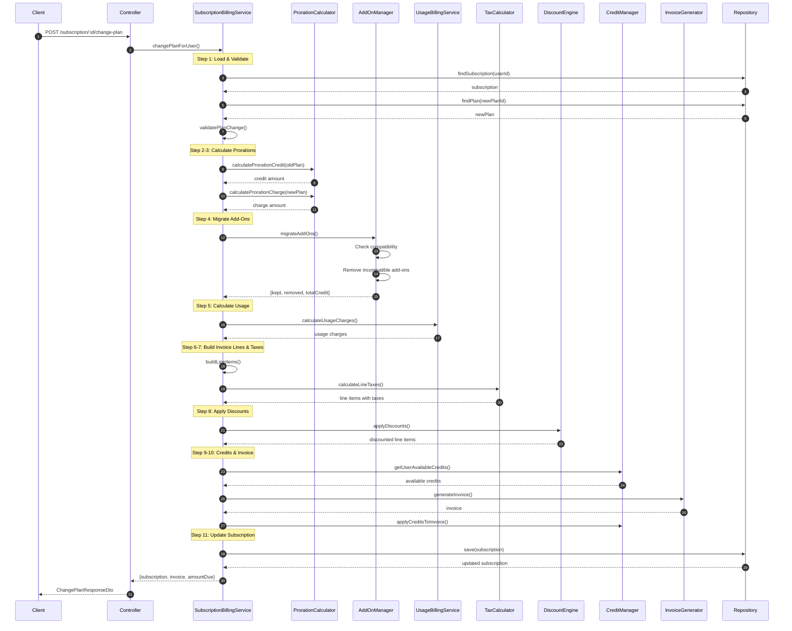
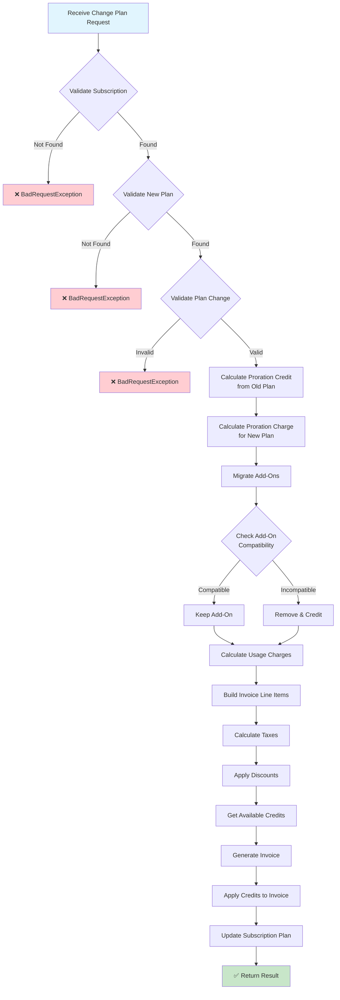

# Billing Module

The billing module handles all subscription management, invoicing, payments, and related billing operations.

## Key Features

- **Subscription Management**: Create, update, and cancel subscriptions
- **Plan Changes**: Upgrade/downgrade with proration support
- **Usage-Based Billing**: Track and bill for metered usage
- **Add-Ons**: Manage subscription add-ons
- **Discounts**: Apply various discount types
- **Credits**: Manage customer credits
- **Invoicing**: Generate and manage invoices
- **Dunning**: Handle failed payment recovery

## Architecture

This module follows the modular architecture principles defined in `docs/MODULAR-ARCHITECTURE-PRINCIPLES.md`.

```
billing/
├── billing.module.ts
├── core/                    # Business logic
│   ├── enum/
│   ├── interface/
│   └── service/
├── http/                    # API layer
│   ├── rest/
│   │   ├── controller/
│   │   └── dto/
│   └── client/
├── persistence/             # Database layer
│   ├── entity/
│   └── repository/
└── integration/             # External integrations
    └── provider/
```

## Flows

### Change Plan Flow

The `changePlan` operation handles subscription plan upgrades and downgrades with full proration support.



### Change Plan - Process Overview



## API Endpoints

### Subscription Billing

| Method | Endpoint | Description |
|--------|----------|-------------|
| `POST` | `/subscription/:id/change-plan` | Change subscription plan |
| `POST` | `/subscription/:id/add-ons` | Add an add-on |
| `DELETE` | `/subscription/:id/add-ons/:addOnId` | Remove an add-on |

### Request/Response Examples

#### Change Plan

**Request:**
```json
POST /subscription/sub-123/change-plan
{
  "newPlanId": "plan-premium-456",
  "chargeImmediately": true,
  "keepAddOns": false
}
```

**Response:**
```json
{
  "subscriptionId": "sub-123",
  "oldPlanId": "plan-basic-123",
  "newPlanId": "plan-premium-456",
  "prorationCredit": 5.00,
  "prorationCharge": 15.00,
  "invoiceId": "inv-789",
  "amountDue": 10.00,
  "nextBillingDate": "2024-02-01T00:00:00.000Z",
  "addOnsRemoved": 0
}
```

## Key Services

| Service | Responsibility |
|---------|----------------|
| `SubscriptionBillingService` | Main orchestrator for billing operations |
| `ProrationCalculatorService` | Calculate proration credits and charges |
| `AddOnManagerService` | Manage subscription add-ons |
| `UsageBillingService` | Calculate usage-based charges |
| `TaxCalculatorService` | Calculate taxes |
| `DiscountEngineService` | Apply discounts |
| `CreditManagerService` | Manage customer credits |
| `InvoiceGeneratorService` | Generate invoices |
| `DunningManagerService` | Handle payment failures |

## Related Documentation

- [Architecture Guidelines](../../../docs/ARCHITECTURE-GUIDELINES.md)
- [Modular Architecture Principles](../../../docs/MODULAR-ARCHITECTURE-PRINCIPLES.md)

