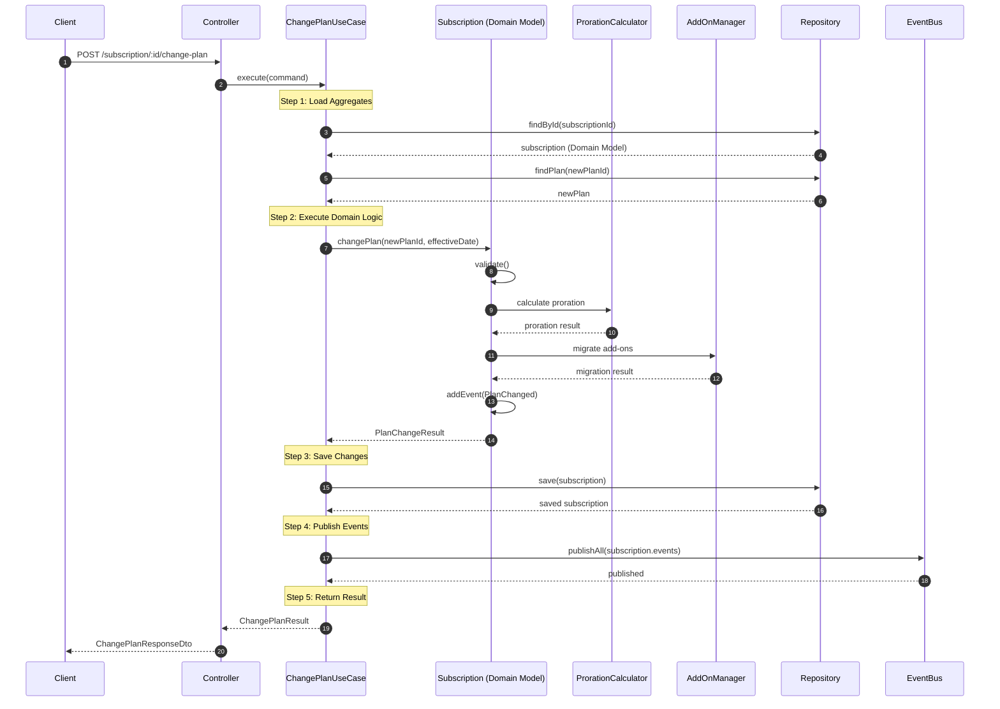

# Billing Module

The billing module handles all subscription management, invoicing, payments, and related billing operations.

**Architecture Pattern**: DDD Tactical Patterns (Rich Domain Model + Use Cases)  
**Last Refactored**: January 2026  
**Status**: ✅ Production Ready

## Key Features

- **Subscription Management**: Create, update, and cancel subscriptions
- **Plan Changes**: Upgrade/downgrade with proration support (Use Case pattern)
- **Usage-Based Billing**: Track and bill for metered usage
- **Add-Ons**: Manage subscription add-ons (Use Case pattern)
- **Discounts**: Apply various discount types
- **Credits**: Manage customer credits
- **Invoicing**: Generate and manage invoices
- **Dunning**: Handle failed payment recovery
- **Domain Events**: Full observability through domain events

## Architecture

This module follows **DDD Tactical Patterns** with:

- ✅ **Rich Domain Models** with encapsulated behavior
- ✅ **Use Cases** for application orchestration
- ✅ **Domain Events** for cross-concern communication
- ✅ **Clean separation**: Domain / Application / Infrastructure layers

See [Tactical DDD Guidelines](../../docs/TACTICAL-DDD-GUIDELINES.md) for details.

## Subscription Module Structure

The subscription feature follows DDD tactical patterns:

```
subscription/
├── core/
│   ├── model/                    # ✅ Rich Domain Models
│   │   └── subscription.model.ts
│   ├── use-case/                 # ✅ Application Layer
│   │   ├── change-plan.use-case.ts
│   │   ├── add-add-on.use-case.ts
│   │   ├── remove-add-on.use-case.ts
│   │   ├── cancel-subscription.use-case.ts
│   │   └── activate-subscription.use-case.ts
│   ├── service/                  # ✅ Domain Services
│   │   ├── proration-calculator.service.ts
│   │   └── add-on-manager.service.ts
│   ├── event/                    # ✅ Domain Events
│   │   ├── subscription-plan-changed.event.ts
│   │   ├── subscription-cancelled.event.ts
│   │   └── add-on-added.event.ts
│   └── enum/
├── persistence/                  # ✅ Infrastructure Layer
│   ├── entity/                   # ORM Entities (Anemic)
│   ├── mapper/                   # Domain ↔ ORM Mappers
│   └── repository/
└── http/
    └── rest/
        ├── controller/
        └── dto/
```

See [Subscription README](./subscription/README.md) for detailed use case documentation.

## Flows

### Change Plan Flow (Use Case Pattern)

The `ChangePlanUseCase` handles subscription plan upgrades and downgrades with full proration support.



    Note over SubscriptionBillingService: Step 11: Update Subscription
    SubscriptionBillingService->>Repository: save(subscription)
    Repository-->>SubscriptionBillingService: updated subscription

    SubscriptionBillingService-->>Controller: {subscription, invoice, amountDue}
    Controller-->>Client: ChangePlanResponseDto

````

### Change Plan - Process Overview (Use Case Pattern)

```mermaid
flowchart TD
    A[Receive Change Plan Command] --> B[Load Subscription Model]
    B --> C[Load New Plan]
    C --> D[Execute Domain Logic]

    D --> E[subscription.changePlan<br/>newPlanId, effectiveDate]
    E --> F{Validate in Domain}
    F -->|Invalid| F1[❌ Domain Exception]
    F -->|Valid| G[Calculate Proration<br/>Domain Service]

    G --> H[Migrate Add-Ons<br/>Domain Service]
    H --> I[Generate Domain Event<br/>PlanChanged]

    I --> J[Save to Repository]
    J --> K[Publish Domain Events]
    K --> L[✅ Return Result]

    style A fill:#e1f5fe
    style E fill:#fff3e0
    style I fill:#f3e5f5
    style L fill:#c8e6c9
    style F1 fill:#ffcdd2
````

**Key Improvements with Use Case Pattern:**

- ~30 lines per use case (vs 178 lines in Transaction Script)
- Domain logic encapsulated in models
- Stateless domain services for calculations
- Clear separation of concerns
- Easier to test and maintain

## API Endpoints

### Subscription Management

| Method   | Endpoint                             | Description                      | Handler                       |
| -------- | ------------------------------------ | -------------------------------- | ----------------------------- |
| `POST`   | `/subscription/:id/change-plan`      | Change subscription plan (async) | `ChangePlanUseCase`           |
| `POST`   | `/subscription/:id/change-plan-sync` | Change subscription plan (sync)  | `ChangePlanUseCase`           |
| `POST`   | `/subscription/:id/add-ons`          | Add an add-on                    | `AddAddOnUseCase`             |
| `DELETE` | `/subscription/:id/add-ons/:addOnId` | Remove an add-on                 | `RemoveAddOnUseCase`          |
| `POST`   | `/subscription/:id/cancel`           | Cancel subscription              | `CancelSubscriptionUseCase`   |
| `POST`   | `/subscription/:id/activate`         | Activate subscription            | `ActivateSubscriptionUseCase` |

### Request/Response Examples

#### Change Plan

**Request:**

```json
POST /subscription/sub-123/change-plan
{
  "newPlanId": "plan-premium-456",
  "chargeImmediately": true,
  "keepAddOns": false
}
```

**Response:**

```json
{
  "subscriptionId": "sub-123",
  "oldPlanId": "plan-basic-123",
  "newPlanId": "plan-premium-456",
  "prorationCredit": 5.0,
  "prorationCharge": 15.0,
  "invoiceId": "inv-789",
  "amountDue": 10.0,
  "nextBillingDate": "2024-02-01T00:00:00.000Z",
  "addOnsRemoved": 0
}
```

## Architecture Components

### Use Cases (Application Layer)

| Use Case                      | Responsibility                          | Lines of Code |
| ----------------------------- | --------------------------------------- | ------------- |
| `ChangePlanUseCase`           | Orchestrate plan changes with proration | ~30           |
| `AddAddOnUseCase`             | Add add-ons to subscriptions            | ~25           |
| `RemoveAddOnUseCase`          | Remove add-ons from subscriptions       | ~25           |
| `CancelSubscriptionUseCase`   | Cancel active subscriptions             | ~20           |
| `ActivateSubscriptionUseCase` | Activate subscriptions                  | ~20           |

### Domain Services (Stateless)

| Service                         | Responsibility                            |
| ------------------------------- | ----------------------------------------- |
| `ProrationCalculatorService`    | Calculate proration credits and charges   |
| `AddOnManagerService`           | Manage add-on compatibility and migration |
| `SubscriptionPlanChangeService` | Async plan change orchestration           |

### Other Services

| Service                   | Responsibility                |
| ------------------------- | ----------------------------- |
| `UsageBillingService`     | Calculate usage-based charges |
| `TaxCalculatorService`    | Calculate taxes               |
| `DiscountEngineService`   | Apply discounts               |
| `CreditManagerService`    | Manage customer credits       |
| `InvoiceGeneratorService` | Generate invoices             |
| `DunningManagerService`   | Handle payment failures       |

## Related Documentation

- [Subscription Module README](./subscription/README.md) - Detailed use case documentation
- [Tactical DDD Guidelines](../../docs/TACTICAL-DDD-GUIDELINES.md) - Domain-driven design patterns
- [Refactoring Roadmap](../../docs/refactoring/CHANGE-PLAN-IMPLEMENTATION-ROADMAP.md) - How we refactored from Transaction Script
- [Architecture Guidelines](../../docs/ARCHITECTURE-GUIDELINES.md) - General architecture principles
- [Modular Architecture Guidelines](../../docs/MODULAR-ARCHITECTURE-GUIDELINES.md) - Module structure principles
- [Replication Guide](../../docs/refactoring/REPLICATION-GUIDE.md) - Apply patterns to other modules

---

**Last Updated**: January 22, 2026  
**Pattern**: DDD Tactical Patterns (Rich Domain Model + Use Cases)  
**Status**: ✅ Production Ready
